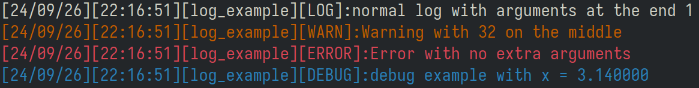
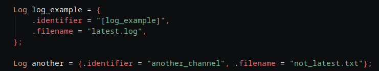

# Simple Header file only library in C to easily make log files 

## Installing:

- You can just grab the lognest.h file and add it to your project,
- You need to remind that only including the file serves as forward declaring
- for the library to serve as implementation, include: `#define LOGNEST_IMPLEMENTATION` before the `#include`

# Is also provided a installed library version, you can take a look on how do use that version if it fits your needs below:

Installing is as easy as:

    git clone https://github.com/LeaoMartelo2/lognest

    cd lognest/installed_library

    make && sudo make install

# Usage:
- The main header should be included: 
`#include <lognest/lognest.h>` (if installed, otherwise use your local: `#include "path/to/lognest.h"`)

- To begin using the library, you'll need to create a logging channel, you can have multiple of them, and they can be printed to the same file or not!.

 
  - `.identifier` Defines what will be its identifier on the file.
  - `.filename` Defines the path and name of the file it will be logged to, different channels can go to the same file or not.

	
- Following the example given above, we can create a log using
`log_trace(&log_example, "Hello, World!");`

	- You can use the logging functions to write your info to the desired file.
	- (`log_trace()`, `log_warn()`, `log_error()` and `log_debug()`)
	- They all accept formmating arguments (`%d, %f, etc`) just like `printf()`

- If you're opting for the installed library, compile with `-lLogNest`
    - As it is a statically linked library, it gets strapped to your application, so you don't need the final user to have it installed aswell.
    - The library itself its small enough to be worth it in to making static, dinamically linking would just hurt the final user at this point.
