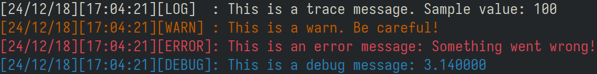
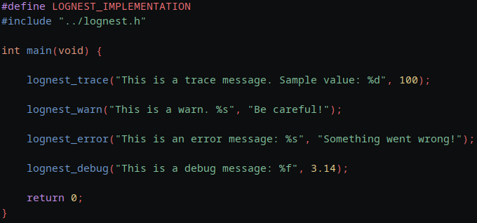

# LogNest

## A "Header file only" library for logging to files made in C, with focus on simplicity



## Installing:

```
wget https://raw.githubusercontent.com/LeaoMartelo2/LogNest/main/lognest.h
```
<sub>just copy this if you are lazy</sub>

## Usage:

- Download `lognest.h` and add it to your project.
- Any specific log level can be disabled with

```c
#define LOGNEST_DISABLE_TRACE
#define LOGNEST_DISABLE_WARN
#define LOGNEST_DISABLE_ERROR
#define LOGNEST_DISABLE_DEBUG
```

(This has to be defined before the implementation define)

- For the library to serve as implementation, add: `#define LOGNEST_IMPLEMENTATION` before the `#include`.
- This also means you should only define the implementation in one file. Just including it serves as a header.
- Optionally cuztomize the output path in `lognest.h`, by changing `#define LOGNEST_FILE "your/custom/path"`
- The path is relative to the executable



## Updates:

### LogNest 2.0 (May 7th, 2025)

- Improved compiler compatibility by removing some parts of the code that i didn't knew were GNU extentions.


- Added new Macros for disabling a log level entirely

you can now disable any log level with:

```c
#define LOGNEST_DISABLE_TRACE
#define LOGNEST_DISABLE_WARN
#define LOGNEST_DISABLE_ERROR
#define LOGNEST_DISABLE_DEBUG
```

That has to be defined before the implementation define, that is already before the #include

- Added a new macro that returns a c literal of the current LogNest version


